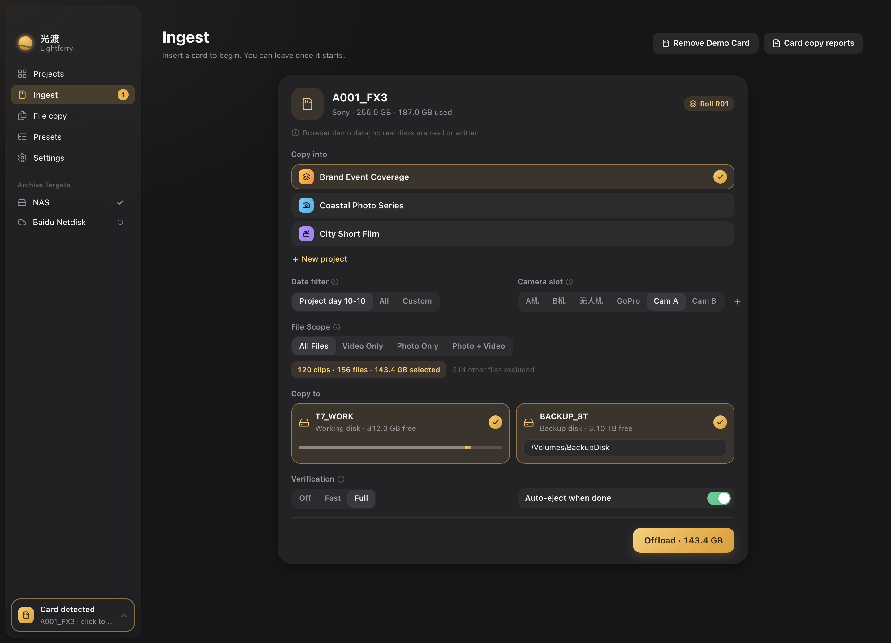
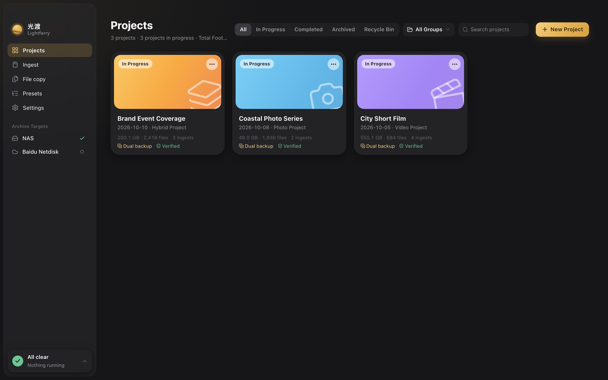
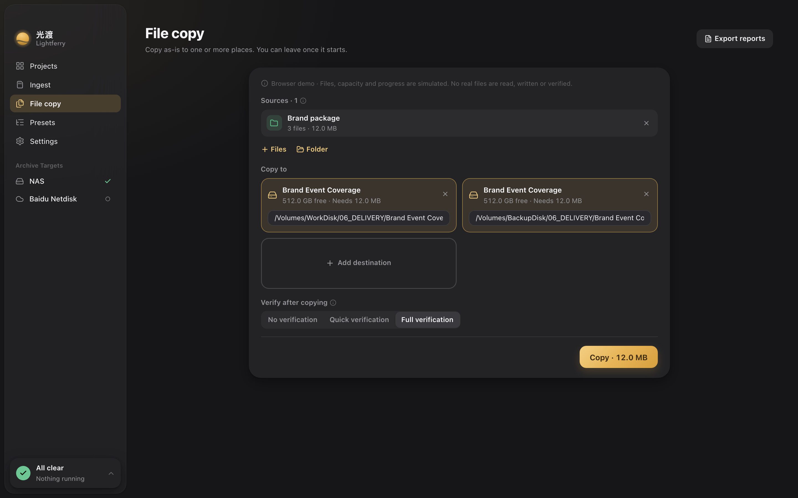

[简体中文](./README.md) · [繁體中文](./README.zh-TW.md) · [English](./README.en.md) · [日本語](./README.ja.md)

  <picture>
    <source media="(prefers-color-scheme: dark)" srcset="./brand/wordmark-stacked-white.svg">
    
  </picture>

<h3 align="center">Bring every moment safely home.</h3>

A Mac media workspace for photographers, DITs, and video production teams. Read a camera card once, write to your working disk and backup disk together, verify every copy, file it by project, and keep a report you can look up later.

  <a href="https://github.com/Sorasukiawa/lightferry/releases/download/v0.2.2/Lightferry_0.2.2_aarch64.dmg"><strong>Download v0.2.2 · Apple Silicon Mac</strong></a>
  &nbsp;·&nbsp; <a href="https://getshiguang.pages.dev/guides/">User guides</a>
  &nbsp;·&nbsp; <a href="https://github.com/Sorasukiawa/lightferry/releases/tag/v0.2.2">What's new</a>
  &nbsp;·&nbsp; <a href="./VERSIONS.md">All versions</a>

Free beta · macOS 13 or later · 简体中文 / 繁體中文 / English / 日本語 · Light and dark themes

Browser demo of the new interface, dark theme. The card, projects, and paths are demo data and do not represent real copy results.

## Copy. Verify. Organize.

<table>
  <tr>
    <td align="center" valign="top" width="25%">
      <picture><source media="(prefers-color-scheme: dark)" srcset="./brand/icons/offload-dawn.svg"></picture> 
      <strong>Camera card ingest</strong> 
      Insert a card and Lightferry finds photo, video, and audio media, filed by project, shoot date, and camera. The source is read once while writing to a working disk and a second backup.
    </td>
    <td align="center" valign="top" width="25%">
      <picture><source media="(prefers-color-scheme: dark)" srcset="./brand/icons/copy-dawn.svg"></picture> 
      <strong>File and folder copy</strong> 
      Drag from Finder or pick a source, keep the folder structure, and write it as is to one or more destinations, with a capacity preflight before you start.
    </td>
    <td align="center" valign="top" width="25%">
      <picture><source media="(prefers-color-scheme: dark)" srcset="./brand/icons/organize-dawn.svg"></picture> 
      <strong>Project media import</strong> 
      Add existing media to a chosen project, mapping photos, video, audio, and project files into its folders.
    </td>
    <td align="center" valign="top" width="25%">
      <picture><source media="(prefers-color-scheme: dark)" srcset="./brand/icons/archive-dawn.svg"></picture> 
      <strong>Project archive</strong> 
      Archive a project to a local or network destination with mandatory full verification. The project record is kept, and local media is never deleted automatically.
    </td>
  </tr>
  <tr>
    <td align="center" valign="top" width="25%">
      <picture><source media="(prefers-color-scheme: dark)" srcset="./brand/icons/verify-dawn.svg"></picture> 
      <strong>Three verification levels</strong> 
      Choose off, fast, or full by how much the footage matters. Every destination gets its own verification result.
    </td>
    <td align="center" valign="top" width="25%">
      <picture><source media="(prefers-color-scheme: dark)" srcset="./brand/icons/recovery-dawn.svg"></picture> 
      <strong>Recovery and retry</strong> 
      After an interruption, a disconnected destination, or a full disk, Lightferry checks destination identity and capacity again, then retries only the incomplete copies without rewriting finished files.
    </td>
    <td align="center" valign="top" width="25%">
      <picture><source media="(prefers-color-scheme: dark)" srcset="./brand/icons/report-dawn.svg"></picture> 
      <strong>Task reports</strong> 
      Find results by project, date, type, and status, and export an offline HTML or multipage PDF. Completion notifications open the matching report.
    </td>
    <td align="center" valign="top" width="25%">
      <picture><source media="(prefers-color-scheme: dark)" srcset="./brand/icons/presets-dawn.svg"></picture> 
      <strong>Folder presets</strong> 
      Built-in structures for video, photo, and hybrid projects that you can duplicate and customize. New projects get the whole folder tree automatically.
    </td>
  </tr>
</table>

## Three promises

- **Existing files are never overwritten.** When names collide, you choose to skip or keep both. Lightferry never replaces files silently.
- **Every copy gets its own result.** Multi-destination tasks record copy and verification status per destination. After an interruption or disconnect, destination identity and capacity are checked again before the incomplete copies are retried.
- **Everything happens on your Mac.** Scanning, copying, verification, and project records are local by default; Lightferry does not upload photos or video to its own server.

## From card to archive

| 1 · Ingest | 2 · Write | 3 · Verify | 4 · Keep |
| --- | --- | --- | --- |
| Insert a camera card or drag in files and folders. Choose a project and camera, and filter by shoot date. | The source is read once and written to the working disk and backup disk together, after a preflight of capacity and destination identity. | Fast verification rereads each copy and compares XXH64. Full verification independently rereads the source as well. | Results can be searched and exported. Projects can be archived to a local or network destination with their records intact. |

## A look at the app

### Project workspace

One card per project: type, shoot date, media size, ingest count, and whether it is dual-backed and verified. Filter by active, completed, archived, and trash, or group projects.

### File copy

Copy files and folders as they are to one or more locations, keeping the folder structure. Free and required space are shown for each destination before you start, and every copy is verified afterwards.

### Task reports

After an ingest, file copy, media import, or archive finishes, find it in task reports by project, date, type, and status, and export an offline HTML or multipage PDF. Missing fields in older records are marked as unknown rather than treated as success.

All screenshots are browser demos of the new interface; projects, files, and paths are demo data.

## Verification levels

| Mode | What it does | Good for |
| --- | --- | --- |
| **Off** | Relies only on write errors | Temporary files; unsuitable for important media |
| **Fast** | Rereads each destination file and compares its XXH64 with the hash computed from the source during copying | Everyday ingest and file copy |
| **Full** | Fast verification plus an independent reread of every source file | Important media, dual backups, archives |

XXH64 detects content differences; it is not a cryptographic signature. Spot-check critical media even after verification passes.

## Get started

1. Download the **Apple Silicon Mac** DMG above. There is no public Intel Mac or Windows installer. Check your chip in **Apple menu → About This Mac**.
2. Open the DMG and drag Lightferry into Applications. If macOS blocks the first launch, verify the app in **System Settings → Privacy & Security** and choose **Open Anyway**. You do not need to disable Gatekeeper.
3. Set your working and backup disks in Settings, create a project, and insert a card. Keep the original card and another reliable backup for important media; format the card only after checking the copies.

| Requirement | Details |
| --- | --- |
| Chip | Apple Silicon (M series) |
| System | macOS 13 or later |
| Storage | APFS is recommended for working, backup, and archive destinations. ExFAT can be a destination once it passes the safety check, and ExFAT camera cards work as read-only sources |

This is a **free beta** with an ad-hoc signature, without Apple Developer ID signing or notarization. Download only from [this repository's Releases](https://github.com/Sorasukiawa/lightferry/releases). Active ingest, file-copy, or archive tasks block installation of an update.

## Current release · v0.2.2

- Clearer task-report layouts, pagination, and content.
- Completion notifications open the matching report; clicks and pending reports persist.
- Confirmed reminders are not resent after clearing notifications or restarting; unknown outcomes pause automatic retries.
- Related settings switches correctly respect their disabled state.

[Full release notes](https://github.com/Sorasukiawa/lightferry/releases/tag/v0.2.2) · [All versions](./VERSIONS.md)

Storage and network folders

- APFS is recommended for working, second-backup, and archive destinations. ExFAT can be a destination only if it passes Lightferry's safety capability check; otherwise writing is refused before it starts. An ExFAT camera card can be a read-only source. Lightferry does not require formatting existing media.
- If you archive to a NAS or a third-party sync folder, Lightferry confirms only the local copy and verification. The operating system or service handles subsequent network transfer or sync; check disconnect and sync behavior in your own environment.

## Help and feedback

[Website](https://getshiguang.pages.dev/) · [Guides](https://getshiguang.pages.dev/guides/) · [Report an issue](https://github.com/Sorasukiawa/lightferry/issues) · Private support: [support@lightferry.app](mailto:support@lightferry.app)

Include the app version, macOS version and chip, source and destination formats, reproduction steps, and complete error text. Redact project names and paths in screenshots. **Do not upload original media or client information.**

## About this repository

This repository hosts installers, documentation, release history, and feedback. **It does not contain the Lightferry app source code or grant an open-source or redistribution license.** GitHub's automatic Source code archives contain only this repository's public materials; they are not app installers.
