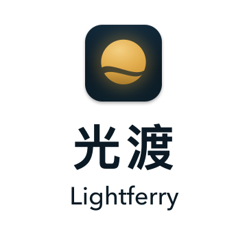
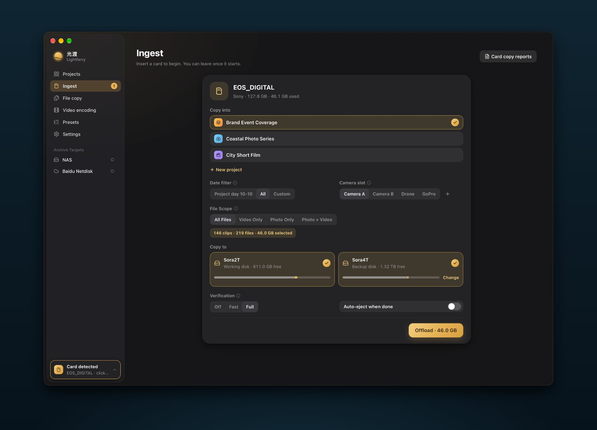
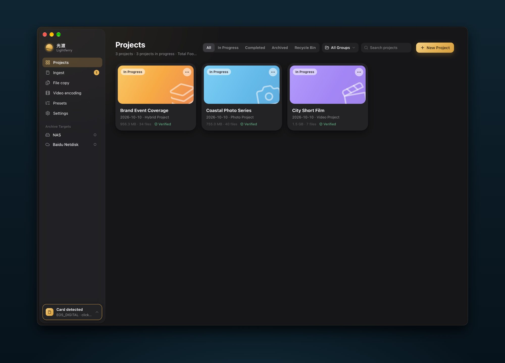
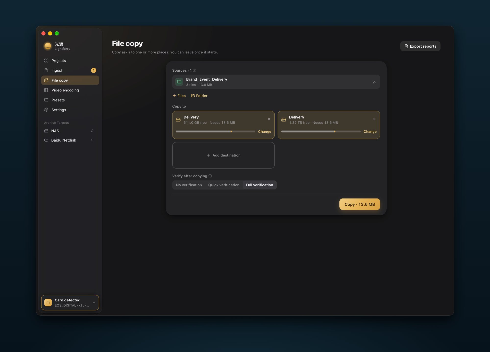

[简体中文](./README.md) · [繁體中文](./README.zh-TW.md) · [English](./README.en.md) · [日本語](./README.ja.md)

  <picture>
    <source media="(prefers-color-scheme: dark)" srcset="./brand/lockup-icon-white.svg">
    
  </picture>

<h3 align="center">Bring every moment safely home.</h3>

A Mac media workspace for photographers, DITs, and video production teams. Read a camera card once, write to your working disk and backup disk together, verify every copy, file it by project, and keep a report you can look up later.

  
  
  

  <a href="https://github.com/Sorasukiawa/lightferry/releases/download/v0.2.2/Lightferry_0.2.2_aarch64.dmg"><strong>Download v0.2.2 · Apple Silicon Mac</strong></a>
  &nbsp;·&nbsp; <a href="https://getshiguang.pages.dev/guides/">User guides</a>
  &nbsp;·&nbsp; <a href="https://github.com/Sorasukiawa/lightferry/releases/tag/v0.2.2">What's new</a>
  &nbsp;·&nbsp; <a href="./VERSIONS.md">All versions</a>

> [!IMPORTANT]
> This is a free beta with an ad-hoc signature, without Apple Developer ID signing or notarization. Download only from [this repository's Releases](https://github.com/Sorasukiawa/lightferry/releases). See [Get started](#get-started) for the first launch.

Actual window capture on a Mac: after inserting a card, choose the project and camera, write to two drives, and verify in full. Sample projects and folders are for demonstration.

## Copy. Verify. Organize.

<table>
  <tr>
    <td valign="top" width="50%">
      <picture><source media="(prefers-color-scheme: dark)" srcset="./brand/icons/offload-dawn.svg"></picture> 
      <strong>Camera card ingest</strong> 
      Insert a card and Lightferry finds photo, video, and audio media, filed by project, shoot date, and camera. The source is read once while writing to a working disk and a second backup.
    </td>
    <td valign="top" width="50%">
      <picture><source media="(prefers-color-scheme: dark)" srcset="./brand/icons/copy-dawn.svg"></picture> 
      <strong>File and folder copy</strong> 
      Drag from Finder or pick a source, keep the folder structure, and write it as is to one or more destinations, with a capacity preflight before you start.
    </td>
  </tr>
  <tr>
    <td valign="top">
      <picture><source media="(prefers-color-scheme: dark)" srcset="./brand/icons/organize-dawn.svg"></picture> 
      <strong>Project media import</strong> 
      Add existing media to a chosen project, placing photos, video, audio, and project files into its folders.
    </td>
    <td valign="top">
      <picture><source media="(prefers-color-scheme: dark)" srcset="./brand/icons/archive-dawn.svg"></picture> 
      <strong>Project archive</strong> 
      Archive a project to a local or network destination with mandatory full verification. The project record is kept, and local media is never deleted automatically.
    </td>
  </tr>
  <tr>
    <td valign="top">
      <picture><source media="(prefers-color-scheme: dark)" srcset="./brand/icons/verify-dawn.svg"></picture> 
      <strong>Three verification levels</strong> 
      Choose off, fast, or full by how much the footage matters. Every destination gets its own verification result.
    </td>
    <td valign="top">
      <picture><source media="(prefers-color-scheme: dark)" srcset="./brand/icons/recovery-dawn.svg"></picture> 
      <strong>Recovery and retry</strong> 
      After an interruption, a disconnected destination, or a full disk, Lightferry checks destination identity and capacity again, then retries only the incomplete copies.
    </td>
  </tr>
  <tr>
    <td valign="top">
      <picture><source media="(prefers-color-scheme: dark)" srcset="./brand/icons/report-dawn.svg"></picture> 
      <strong>Task reports</strong> 
      Find results by project, date, type, and status, and export an offline HTML or multipage PDF. Completion notifications open the matching report.
    </td>
    <td valign="top">
      <picture><source media="(prefers-color-scheme: dark)" srcset="./brand/icons/presets-dawn.svg"></picture> 
      <strong>Folder presets</strong> 
      Built-in structures for video, photo, and hybrid projects that you can duplicate and customize. New projects get the whole folder tree automatically.
    </td>
  </tr>
</table>

## Three promises

- **Existing files are never overwritten.** When names collide, you choose to skip or keep both. Lightferry never replaces files silently.
- **Every copy gets its own result.** Multi-destination tasks record copy and verification status per destination. After an interruption or disconnect, destination identity and capacity are checked again before the incomplete copies are retried.
- **Everything happens on your Mac.** Scanning, copying, verification, and project records are local by default; Lightferry does not upload photos or video to its own server.

## Why not just drag in Finder?

| | Finder drag and drop | Lightferry |
| --- | --- | --- |
| Two drives | Drag twice; the card is read twice | Read once, write both |
| After copying | Contents are not checked | Fast or full verification per copy |
| Unplugged or interrupted | Start over or compare by hand | Retry only unfinished files |
| Same names | May offer to replace | Never overwrites existing files |
| Folders | Create them by hand | Filed by project, date, and camera |
| Records | None | Task reports in HTML or PDF |

## From card to archive

1. **Ingest**: insert a camera card or drag in files and folders. Choose a project and camera, and filter by shoot date.
2. **Write**: the source is read once and written to the working disk and backup disk together, after a preflight of capacity and destination identity.
3. **Verify**: fast verification rereads each copy and compares XXH64. Full verification independently rereads the source as well.
4. **Keep**: results can be searched and exported. Projects can be archived to a local or network destination with their records intact.

## A look at the app

### Project workspace

One card per project shows the type, shoot date, media size, and file count. After an ingest, it also shows whether the project is dual-backed and verified. Filter by active, completed, archived, and trash, or group projects.

### File copy

Copy files and folders as they are to one or more locations, keeping the folder structure. Free and required space are shown for each destination before you start, and every copy is verified afterwards.

### Task reports

After an ingest, file copy, media import, or archive finishes, find it in task reports by project, date, type, and status, and export an offline HTML or multipage PDF. Missing fields in older records are marked as unknown rather than treated as success.

All screenshots are actual window captures on a Mac; projects, files, and paths are for demonstration.

## Verification levels

- **Off**: relies only on write errors. Fine for temporary files, not for important media.
- **Fast**: rereads each destination file and compares its XXH64 with the hash computed from the source during copying. Good for everyday ingest and file copy.
- **Full**: fast verification plus an independent reread of every source file. Best for important media, dual backups, and archives.

XXH64 detects content differences; it is not a cryptographic signature. Spot-check critical media even after verification passes.

## Get started

1. Download the **Apple Silicon Mac** DMG above. There is no public Intel Mac or Windows installer. Check your chip in **Apple menu → About This Mac**.
2. Open the DMG and drag Lightferry into Applications. If macOS blocks the first launch, verify the app in **System Settings → Privacy & Security** and choose **Open Anyway**. You do not need to disable Gatekeeper.
3. Set your working and backup disks in Settings, create a project, and insert a card. Keep the original card and another reliable backup for important media; format the card only after checking the copies.

- **Chip**: Apple Silicon (M series)
- **System**: macOS 13 or later
- **Storage**: APFS is recommended for working, backup, and archive destinations. ExFAT can be a destination once it passes the safety check, and ExFAT camera cards work as read-only sources

Active ingest, file-copy, or archive tasks block installation of an update.

## FAQ

<strong>What if macOS cannot open the app?</strong>

The public beta is not notarized by Apple. After confirming the file came from this repository's Releases, follow step 2 of Get started and choose Open Anyway in Privacy & Security. [Installation help](https://getshiguang.pages.dev/download/#download-help)

<strong>Do I need to start over after unplugging a drive or a failed task?</strong>

No. Keep the original card, existing copies, and task history. Reconnect the original devices and check the recovery entry. Recovery checks completed files and copies the unfinished ones; do not delete existing copies first.

<strong>Can I format my card if verification failed?</strong>

Not yet. Check every destination, keep the card and valid copies, and use the failure record to investigate and retry. A 100% progress bar does not mean every copy passed verification. [What to check after an ingest](https://getshiguang.pages.dev/guides/first-ingest/)

<strong>Can I ingest directly to a NAS?</strong>

Ingest to a local or external drive first, then archive to your NAS from project details. [NAS archive guide](https://getshiguang.pages.dev/guides/connect-nas/)

<strong>Does local archiving mean the cloud upload is complete?</strong>

No. Lightferry confirms local copying and verification. Check the upload separately in your cloud client and in the cloud. [Cloud sync guide](https://getshiguang.pages.dev/guides/baidu-sync/)

<strong>Does it support Intel or Windows, and is it free?</strong>

The public release is for Apple silicon Macs only and is free without applying or paying. Prices and license terms will be announced before sales begin.

## Current release · v0.2.2

- Clearer task-report layouts, pagination, and content.
- Completion notifications open the matching report; clicks and pending reports persist.
- Confirmed reminders are not resent after clearing notifications or restarting; unknown outcomes pause automatic retries.
- Related settings switches correctly respect their disabled state.

[Full release notes](https://github.com/Sorasukiawa/lightferry/releases/tag/v0.2.2) · [All versions](./VERSIONS.md)

Storage and network folders

- APFS is recommended for working, second-backup, and archive destinations. ExFAT can be a destination only if it passes Lightferry's safety capability check; otherwise writing is refused before it starts. An ExFAT camera card can be a read-only source. Lightferry does not require formatting existing media.
- If you archive to a NAS or a third-party sync folder, Lightferry confirms only the local copy and verification. The operating system or service handles subsequent network transfer or sync; check disconnect and sync behavior in your own environment.

## Help and feedback

- **[User guides](https://getshiguang.pages.dev/guides/)**: step-by-step guides for installing, ingesting, recovering interrupted tasks, and archiving.
- **[Report an issue or request a feature](https://github.com/Sorasukiawa/lightferry/issues/new/choose)**: the form asks for the app version, macOS version and chip, source and destination formats, reproduction steps, and error text.
- **[Questions and ideas](https://github.com/Sorasukiawa/lightferry/discussions)**: usage questions, workflows, and ideas.
- **Private matters**: email [support@lightferry.app](mailto:support@lightferry.app). For security issues, see [SECURITY.md](./SECURITY.md).

Redact project names and paths in screenshots. **Do not upload original media or client information.**

## About this repository

> [!NOTE]
> This repository hosts installers, documentation, release history, and feedback. **It does not contain the Lightferry app source code or grant an open-source or redistribution license**; see [LICENSE.md](./LICENSE.md). GitHub's automatic Source code archives contain only this repository's public materials; they are not app installers.
