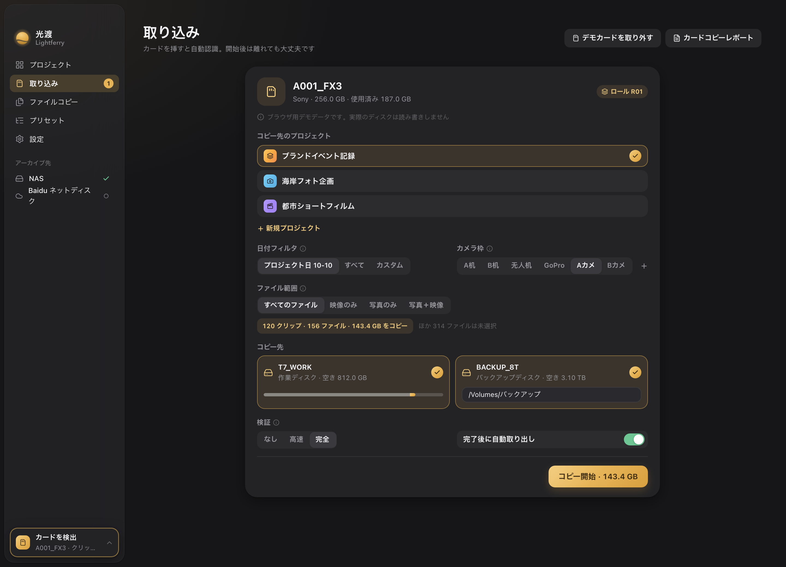
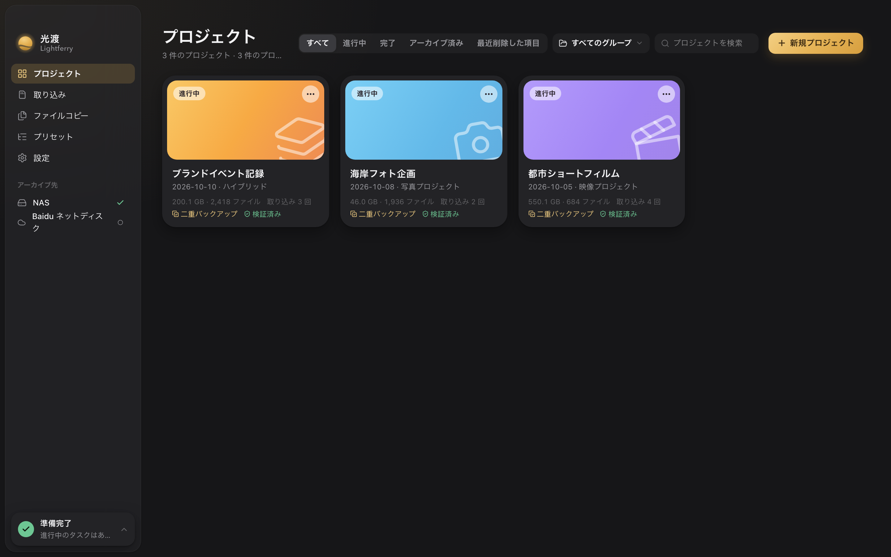
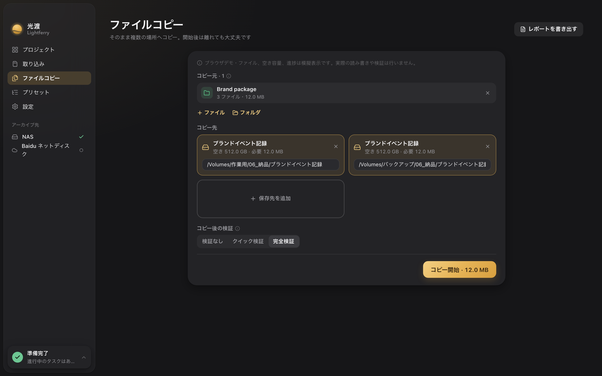

[简体中文](./README.md) · [繁體中文](./README.zh-TW.md) · [English](./README.en.md) · [日本語](./README.ja.md)

  <picture>
    <source media="(prefers-color-scheme: dark)" srcset="./brand/wordmark-stacked-white.svg">
    
  </picture>

<h3 align="center">撮りためた光を、次の場所へ。</h3>

写真家、DIT、映像制作チームのための Mac 用素材ワークスペース。 カメラカードを一度読み、作業用ディスクとバックアップへ同時に書き込み、コピーを一つずつ検証し、プロジェクトごとに整理して、後から確認できるレポートを残します。

  <a href="https://github.com/Sorasukiawa/lightferry/releases/download/v0.2.2/Lightferry_0.2.2_aarch64.dmg"><strong>v0.2.2 をダウンロード · Apple Silicon Mac</strong></a>
  &nbsp;·&nbsp; <a href="https://getshiguang.pages.dev/guides/">使い方</a>
  &nbsp;·&nbsp; <a href="https://github.com/Sorasukiawa/lightferry/releases/tag/v0.2.2">更新内容</a>
  &nbsp;·&nbsp; <a href="./VERSIONS.md">すべてのバージョン</a>

無料ベータ版 · macOS 13 以降 · 简体中文 / 繁體中文 / English / 日本語 · ライト／ダークテーマ

新しいインターフェースのブラウザーデモ、ダークテーマ。カード、プロジェクト、パスはデモデータで、実際のコピー結果ではありません。

## コピー・検証・整理

<table>
  <tr>
    <td align="center" valign="top" width="25%">
      <picture><source media="(prefers-color-scheme: dark)" srcset="./brand/icons/offload-dawn.svg"></picture> 
      <strong>カード取り込み</strong> 
      カードを挿すと写真・動画・音声を検出し、プロジェクト、撮影日、カメラごとに整理。元カードを一度読み、作業用と二つ目のバックアップ先へ同時に書き込みます。
    </td>
    <td align="center" valign="top" width="25%">
      <picture><source media="(prefers-color-scheme: dark)" srcset="./brand/icons/copy-dawn.svg"></picture> 
      <strong>ファイル／フォルダーのコピー</strong> 
      Finder からドラッグ、または選択。階層を保ったまま一つ以上の保存先へそのままコピーし、開始前に空き容量を確認します。
    </td>
    <td align="center" valign="top" width="25%">
      <picture><source media="(prefers-color-scheme: dark)" srcset="./brand/icons/organize-dawn.svg"></picture> 
      <strong>プロジェクトへの素材追加</strong> 
      既存の素材を指定プロジェクトへ追加し、写真・動画・音声・制作ファイルなどをプロジェクトのフォルダーへ振り分けます。
    </td>
    <td align="center" valign="top" width="25%">
      <picture><source media="(prefers-color-scheme: dark)" srcset="./brand/icons/archive-dawn.svg"></picture> 
      <strong>プロジェクトのアーカイブ</strong> 
      ローカルまたはネットワーク先へアーカイブ。完全検証を必ず実行し、プロジェクト記録を保持したまま、ローカル素材を自動削除しません。
    </td>
  </tr>
  <tr>
    <td align="center" valign="top" width="25%">
      <picture><source media="(prefers-color-scheme: dark)" srcset="./brand/icons/verify-dawn.svg"></picture> 
      <strong>3 段階の検証</strong> 
      なし・高速・完全を素材の重要度で選択。保存先ごとに検証結果を示します。
    </td>
    <td align="center" valign="top" width="25%">
      <picture><source media="(prefers-color-scheme: dark)" srcset="./brand/icons/recovery-dawn.svg"></picture> 
      <strong>中断後の復旧と再試行</strong> 
      中断、保存先の切断、ディスクの空き不足の後は、保存先の識別情報と空き容量を再確認し、未完了のコピーだけを再試行。完了済みのファイルは書き直しません。
    </td>
    <td align="center" valign="top" width="25%">
      <picture><source media="(prefers-color-scheme: dark)" srcset="./brand/icons/report-dawn.svg"></picture> 
      <strong>作業レポート</strong> 
      プロジェクト、日付、種類、状態で結果を探し、オフライン HTML または複数ページの PDF に書き出し。完了通知から該当レポートを開けます。
    </td>
    <td align="center" valign="top" width="25%">
      <picture><source media="(prefers-color-scheme: dark)" srcset="./brand/icons/presets-dawn.svg"></picture> 
      <strong>フォルダープリセット</strong> 
      映像・写真・ハイブリッド用の内蔵構成を複製してカスタマイズ。新規プロジェクトにはフォルダー一式が自動で作られます。
    </td>
  </tr>
</table>

## 三つの約束

- **既存ファイルを上書きしません。** 同名のものがあればスキップか両方保持を選べます。黙って置き換えることはありません。
- **コピーごとに結果を残します。** 複数の保存先は別々にコピーと検証の状態を記録。中断や切断の後は保存先の識別情報と空き容量を再確認してから、未完了分だけを再試行します。
- **すべて Mac の中で完結します。** 素材の走査・コピー・検証とプロジェクト記録は既定でローカル処理され、光渡のサーバーへ写真や動画をアップロードしません。

## カードからアーカイブまで

| 1 · 取り込み | 2 · 書き込み | 3 · 検証 | 4 · 保管 |
| --- | --- | --- | --- |
| カメラカードを挿す、またはファイルやフォルダーをドラッグ。プロジェクトとカメラを選び、撮影日で絞り込みます。 | 空き容量と保存先の識別情報を確認してから、元データを一度読み、作業用とバックアップへ同時に書き込みます。 | 高速検証は各コピーを読み直して XXH64 を比較。完全検証はさらに元データも独立して読み直します。 | 結果は検索・書き出しが可能。プロジェクトは記録を保ったままローカルやネットワーク先へアーカイブできます。 |

## 画面を見る

### プロジェクト

プロジェクトごとに 1 枚のカード：種類、撮影日、素材量、取り込み回数、二重バックアップと検証済みの表示。進行中・完了・アーカイブ済み・ゴミ箱で絞り込み、グループ分けもできます。

### ファイルコピー

ファイルとフォルダーを階層そのままに一つ以上の場所へコピー。開始前に保存先ごとの空き容量と必要容量を表示し、コピー後に一つずつ検証します。

### 作業レポート

取り込み、ファイルコピー、素材追加、アーカイブが終わると、作業レポートでプロジェクト、日付、種類、状態から探し、オフライン HTML または複数ページの PDF に書き出せます。過去の記録にない項目は「未記録」と示し、成功と推定しません。

いずれも新しいインターフェースのブラウザーデモ。プロジェクト、ファイル、パスはデモデータです。

## 検証の種類

| モード | 内容 | 向いている用途 |
| --- | --- | --- |
| **なし** | 書き込み時のエラーだけを確認 | 一時的なファイル。大切な素材には不向き |
| **高速** | 各保存先のファイルを読み直し、コピー時に計算した元ファイルの XXH64 と比較 | 日常の取り込みとファイルコピー |
| **完全** | 高速検証に加え、すべての元ファイルを独立して読み直し | 大切な素材、二重バックアップ、アーカイブ |

XXH64 は内容の差を調べるもので、暗号学的な署名ではありません。検証後も重要な素材は目視で確認してください。

## 使い始める

1. 上の **Apple Silicon Mac** 用 DMG をダウンロードしてください。Intel Mac と Windows 向けの公開インストーラーはありません。チップは ** → この Mac について** で確認できます。
2. DMG を開き、光渡を「アプリケーション」へドラッグします。macOS が初回起動を止めた場合は、**システム設定 → プライバシーとセキュリティ** でアプリを確認し、「このまま開く」を選びます。Gatekeeper を無効にする必要はありません。
3. 設定で作業用とバックアップのディスクを選び、プロジェクトを作り、カードを挿せば始められます。大切な素材は元カードと別の信頼できるバックアップを残し、コピー確認後にカードを初期化してください。

| 要件 | 内容 |
| --- | --- |
| チップ | Apple Silicon（M シリーズ） |
| システム | macOS 13 以降 |
| ストレージ | 作業用・バックアップ・アーカイブ先には APFS を推奨。安全機能の確認を通った ExFAT は保存先に使え、ExFAT のカメラカードは読み取り専用の元データとして使えます |

現在は**無料ベータ版**です。ad-hoc 署名を使用しており、Apple Developer ID 署名と公証はありません。[このリポジトリの Releases](https://github.com/Sorasukiawa/lightferry/releases) からのみ入手してください。カード取り込み、ファイルコピー、アーカイブの実行中は更新をインストールできません。

## 最新版 · v0.2.2

- 作業レポートのレイアウト、改ページ、内容表示を改善しました。
- 完了通知から該当レポートを開けます。クリックと未表示レポートは保持されます。
- 通知の消去や再起動後も送信確認済みの通知は再送しません。結果が不明な場合は自動再送を停止します。
- 関連する設定スイッチの無効状態を修正しました。

[詳しいリリースノート](https://github.com/Sorasukiawa/lightferry/releases/tag/v0.2.2) · [すべてのバージョン](./VERSIONS.md)

保存先とネットワークフォルダー

- 作業用、第二バックアップ、アーカイブ先には APFS を推奨します。ExFAT を保存先に使う場合は光渡の安全機能の確認が必要で、確認できなければ書き込み前に拒否します。ExFAT のカメラカードは読み取り専用の元データとして使えます。既存メディアの初期化は要求しません。
- NAS や外部同期フォルダーをアーカイブ先に選んだ場合、光渡が確認するのはローカルのコピーと検証だけです。その後の転送・同期は OS または各サービスが担当し、切断や同期の動作は利用環境で確認してください。

## ヘルプとフィードバック

[公式サイト](https://getshiguang.pages.dev/) · [使い方](https://getshiguang.pages.dev/guides/) · [問題を報告](https://github.com/Sorasukiawa/lightferry/issues) · 非公開のお問い合わせ：[support@lightferry.app](mailto:support@lightferry.app)

報告にはアプリと macOS のバージョン、チップ、元データと保存先の形式、再現手順、エラー全文を添えてください。画像のプロジェクト名やパスは隠し、**元の素材や顧客情報はアップロードしないでください**。

## このリポジトリについて

このリポジトリはインストーラー、説明、リリース履歴、フィードバックを公開します。**光渡アプリのソースコードは含まず、オープンソースライセンスや再配布の許可もありません。** GitHub が自動生成する Source code は、このリポジトリの公開資料をまとめたもので、アプリのインストーラーではありません。
