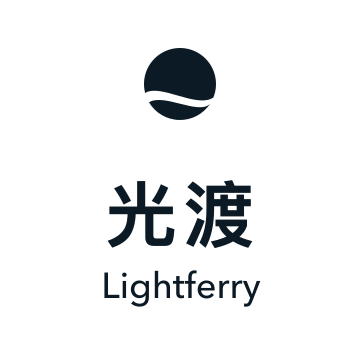
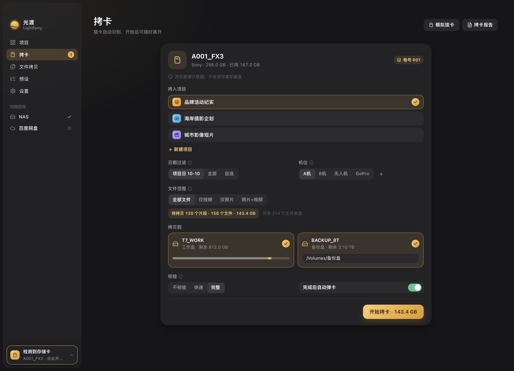
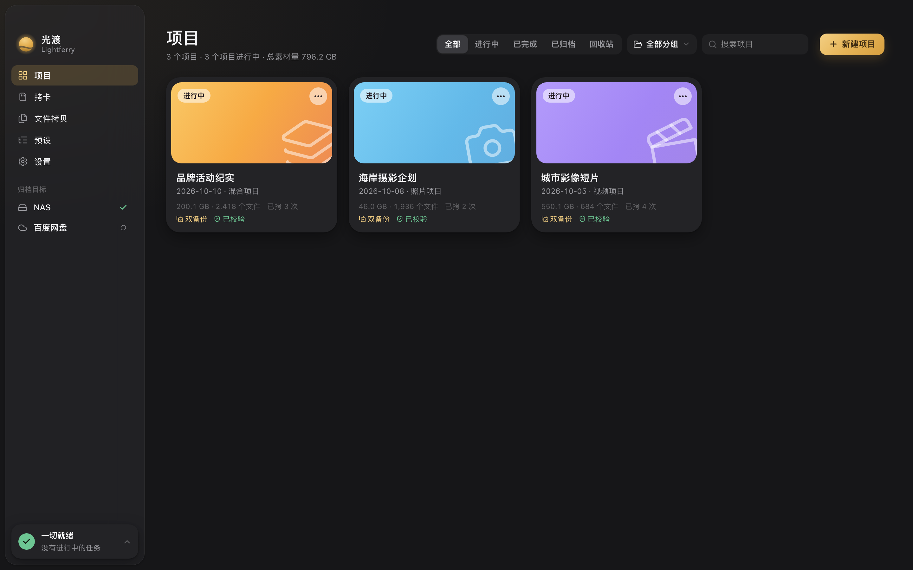
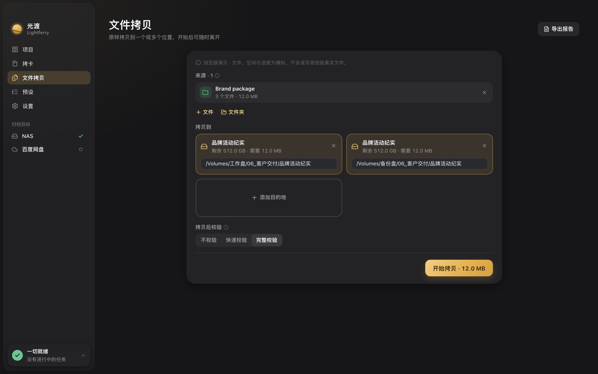

[简体中文](./README.md) · [繁體中文](./README.zh-TW.md) · [English](./README.en.md) · [日本語](./README.ja.md)

  <picture>
    <source media="(prefers-color-scheme: dark)" srcset="./brand/wordmark-stacked-white.svg">
    
  </picture>

<h3 align="center">让每一束光，安然抵达。</h3>

面向摄影师、DIT 与影像制作团队的 Mac 素材工作台。 读一次相机卡，同时写入工作盘与备份盘；逐份校验，按项目归位，留下可查的报告。

  <a href="https://github.com/Sorasukiawa/lightferry/releases/download/v0.2.2/Lightferry_0.2.2_aarch64.dmg"><strong>下载 v0.2.2 · Apple Silicon Mac</strong></a>
  &nbsp;·&nbsp; <a href="https://getshiguang.pages.dev/guides/">使用指南</a>
  &nbsp;·&nbsp; <a href="https://github.com/Sorasukiawa/lightferry/releases/tag/v0.2.2">本次更新</a>
  &nbsp;·&nbsp; <a href="./VERSIONS.md">全部版本</a>

免费内测 · macOS 13 及以上 · 简体中文 / 繁體中文 / English / 日本語 · 浅色与深色主题

新版界面的浏览器演示截图，深色主题；存储卡、项目与路径均为演示数据，不代表真实拷贝结果。

## 拷贝 · 校验 · 整理

<table>
  <tr>
    <td align="center" valign="top" width="25%">
      <picture><source media="(prefers-color-scheme: dark)" srcset="./brand/icons/offload-dawn.svg"></picture> 
      <strong>相机卡拷卡</strong> 
      插卡自动识别照片、视频与音频，按项目、拍摄日与机位归位。读取一次来源，同时写入工作盘与第二备份盘。
    </td>
    <td align="center" valign="top" width="25%">
      <picture><source media="(prefers-color-scheme: dark)" srcset="./brand/icons/copy-dawn.svg"></picture> 
      <strong>文件与文件夹拷贝</strong> 
      从 Finder 拖入或选择来源，保留目录层级，原样写入一个或多个目的地；开始前预检空间。
    </td>
    <td align="center" valign="top" width="25%">
      <picture><source media="(prefers-color-scheme: dark)" srcset="./brand/icons/organize-dawn.svg"></picture> 
      <strong>项目素材导入</strong> 
      把已有素材加入指定项目，按照片、视频、音频、工程文件等类别映射到项目目录。
    </td>
    <td align="center" valign="top" width="25%">
      <picture><source media="(prefers-color-scheme: dark)" srcset="./brand/icons/archive-dawn.svg"></picture> 
      <strong>项目归档</strong> 
      把项目归档到本地或网络目标，归档前强制完整校验；保留原项目记录，不会自动删除本地素材。
    </td>
  </tr>
  <tr>
    <td align="center" valign="top" width="25%">
      <picture><source media="(prefers-color-scheme: dark)" srcset="./brand/icons/verify-dawn.svg"></picture> 
      <strong>三档校验</strong> 
      不校验、快速校验、完整校验按素材重要程度选择；每个目的地单独给出校验结果。
    </td>
    <td align="center" valign="top" width="25%">
      <picture><source media="(prefers-color-scheme: dark)" srcset="./brand/icons/recovery-dawn.svg"></picture> 
      <strong>中断恢复与补拷</strong> 
      中断、目标掉线或盘满后，先重新确认目标身份和空间，再只补未完成的副本，不重写已完成的文件。
    </td>
    <td align="center" valign="top" width="25%">
      <picture><source media="(prefers-color-scheme: dark)" srcset="./brand/icons/report-dawn.svg"></picture> 
      <strong>任务报告</strong> 
      按项目、日期、类型与状态查找任务结果，导出离线 HTML 或多页 PDF；完成通知可直接打开对应报告。
    </td>
    <td align="center" valign="top" width="25%">
      <picture><source media="(prefers-color-scheme: dark)" srcset="./brand/icons/presets-dawn.svg"></picture> 
      <strong>文件夹预设</strong> 
      内置视频、照片与混合项目的目录结构，可复制后自定义；新建项目时自动生成整套文件夹。
    </td>
  </tr>
</table>

## 三条底线

- **不覆盖已有文件。** 遇到同名内容由你决定跳过或两份都保留，光渡不会静默替换。
- **每一份副本都有自己的结果。** 多目标任务分别记录拷贝与校验状态；中断或目标掉线后，先重新确认目标身份和空间，再补齐未完成的副本。
- **一切在本机完成。** 素材扫描、拷贝、校验和项目记录默认在本机完成，不会上传到光渡服务器。

## 从插卡到归档

| 1 · 收取 | 2 · 落盘 | 3 · 校验 | 4 · 留档 |
| --- | --- | --- | --- |
| 插入相机卡，或拖入文件与文件夹；选择项目与机位，按拍摄日过滤。 | 读取一次来源，同时写入工作盘与备份盘；开始前先预检空间与目标身份。 | 快速校验回读每份副本比对 XXH64；完整校验再独立重读来源。 | 任务结果可查找、导出；项目可归档到本地或网络目标，并保留记录。 |

## 看看界面

### 项目工作台

每个项目一张卡片：类型、拍摄日、素材量与拷卡次数，以及是否双备份、是否通过校验。按进行中、已完成、已归档与回收站筛选，也可以分组。

### 文件拷贝

文件与文件夹原样拷到一个或多个位置，保留目录层级；开始前显示每个目的地的剩余空间与所需空间，拷完逐份校验。

### 任务报告

拷卡、文件拷贝、素材导入与归档完成后，都能在任务报告里按项目、日期、类型与状态查找，并导出离线 HTML 或多页 PDF。旧记录缺失的字段会标为「未记录」，不会推定成功。

以上均为新版界面的浏览器演示截图；项目、文件与路径均为演示数据。

## 校验方式

| 模式 | 做什么 | 适合 |
| --- | --- | --- |
| **不校验** | 只依据写入过程是否报错 | 临时文件；不适合重要素材 |
| **快速校验** | 重读每份目标文件，计算 XXH64 与写入时的来源哈希比对 | 日常拷卡与文件拷贝 |
| **完整校验** | 在快速校验之上，再独立重读全部来源文件 | 重要素材、双备份、归档 |

XXH64 用于检测内容差异，不是加密签名；通过后仍应人工抽查关键素材。

## 开始使用

1. 在上方下载 **Apple Silicon Mac** 版 DMG；Intel Mac 与 Windows 暂无公开安装包。可在 ** → 关于本机** 查看芯片。
2. 打开 DMG，把光渡拖进「应用程序」。首次启动若被 macOS 拦截，前往 **系统设置 → 隐私与安全性**，核对应用后选择「仍要打开」。无需关闭 Gatekeeper。
3. 在设置里选好工作盘与备份盘，新建项目，插卡即可开始。重要素材请保留原卡及另一份可靠备份，确认副本后再格式化卡片。

| 要求 | 说明 |
| --- | --- |
| 芯片 | Apple Silicon（M 系列） |
| 系统 | macOS 13 及以上 |
| 存储 | 工作盘、备份盘与归档目标推荐 APFS；通过安全能力检查的 ExFAT 可作目标，ExFAT 相机卡可作只读来源 |

当前为 **免费内测版**，采用 ad-hoc 签名，尚无 Apple Developer ID 签名或 Apple 公证。请只从[本仓库 Releases](https://github.com/Sorasukiawa/lightferry/releases)下载。正在运行的拷卡、文件拷贝或归档任务会阻止更新安装。

## 当前版本 · v0.2.2

- 改进任务报告的布局、分页与内容展示。
- 完成通知可打开对应报告，点击与待打开报告持久保存。
- 清除通知、退出或重启后不会重复发送已确认的提醒；结果不明时暂停自动重发。
- 修复设置子开关的禁用状态。

[阅读完整发布说明](https://github.com/Sorasukiawa/lightferry/releases/tag/v0.2.2) · [浏览所有版本](./VERSIONS.md)

存储盘与网络目录

- 工作盘、第二备份盘和归档目标推荐 APFS。ExFAT 可作为目标盘，但必须先通过光渡的安全能力检查；无法证明安全时会在写入前拒绝。ExFAT 相机卡可作为只读来源。光渡不会要求格式化已有介质。
- 若选择 NAS 或第三方同步文件夹作为归档目标，光渡只确认本地复制与校验；后续网络传输或同步由对应系统与服务处理，网络盘断连和同步服务的行为仍需按实际环境核对。

## 帮助与反馈

[官网](https://getshiguang.pages.dev/) · [使用指南](https://getshiguang.pages.dev/guides/) · [提交问题或建议](https://github.com/Sorasukiawa/lightferry/issues) · 不便公开的问题：[support@lightferry.app](mailto:support@lightferry.app)

反馈时请提供版本、macOS 与芯片型号、来源和目标格式、复现步骤及错误文字；截图请遮挡项目名和路径，**不要上传原始素材或客户资料**。

## 关于本仓库

本仓库用于发布安装包、说明、版本记录与反馈。**仓库不包含光渡 App 源代码，未提供开源许可证或再分发授权。** GitHub 自动生成的 Source code 压缩包只是本仓库公开资料，不能安装为光渡。
