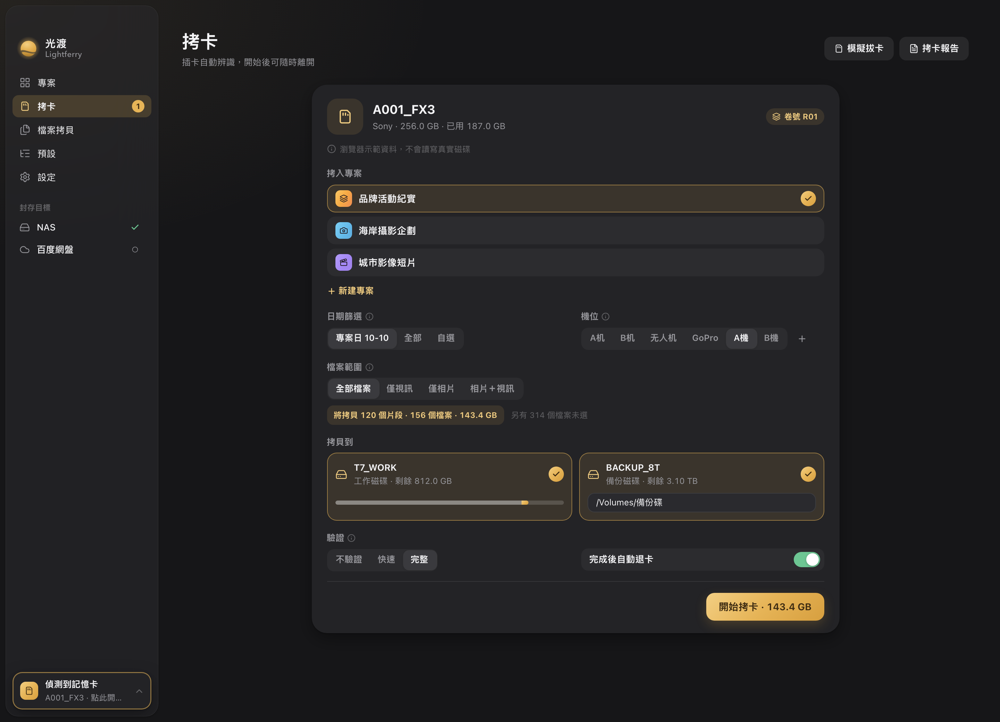
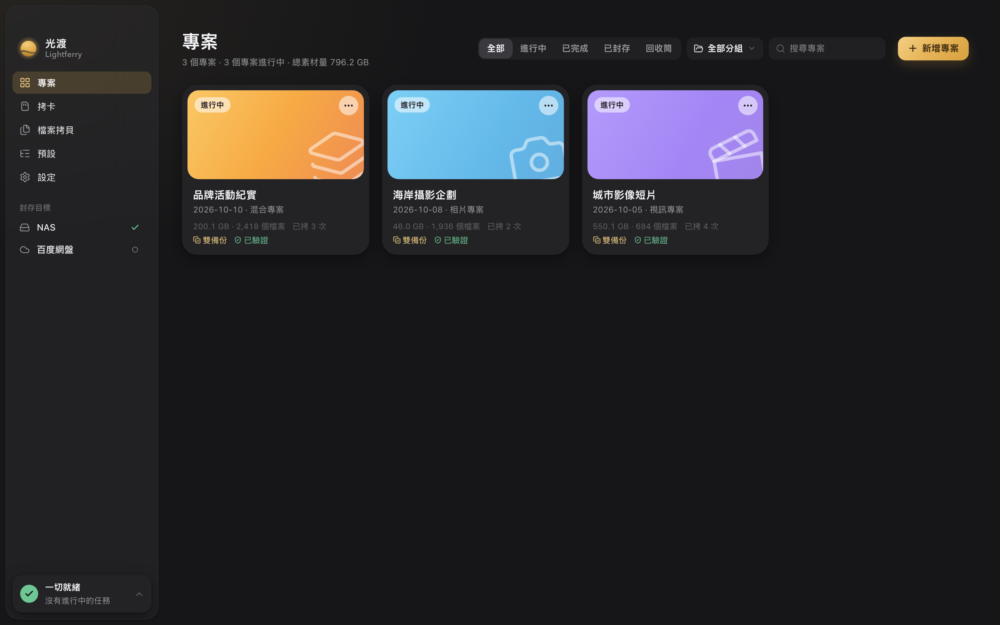
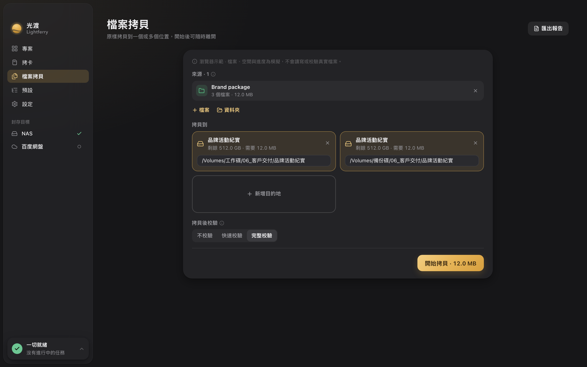

[简体中文](./README.md) · [繁體中文](./README.zh-TW.md) · [English](./README.en.md) · [日本語](./README.ja.md)

  <picture>
    <source media="(prefers-color-scheme: dark)" srcset="./brand/wordmark-stacked-white.svg">
    
  </picture>

<h3 align="center">讓每一束光，安然抵達。</h3>

為攝影師、DIT 與影像製作團隊設計的 Mac 素材工作台。 讀一次記憶卡，同時寫入工作碟與備份碟；逐份驗證，依專案歸位，留下可查的報告。

  <a href="https://github.com/Sorasukiawa/lightferry/releases/download/v0.2.2/Lightferry_0.2.2_aarch64.dmg"><strong>下載 v0.2.2 · Apple Silicon Mac</strong></a>
  &nbsp;·&nbsp; <a href="https://getshiguang.pages.dev/guides/">使用指南</a>
  &nbsp;·&nbsp; <a href="https://github.com/Sorasukiawa/lightferry/releases/tag/v0.2.2">本次更新</a>
  &nbsp;·&nbsp; <a href="./VERSIONS.md">全部版本</a>

免費測試版 · macOS 13 及以上 · 简体中文 / 繁體中文 / English / 日本語 · 淺色與深色主題

新版介面的瀏覽器演示截圖，深色主題；記憶卡、專案與路徑均為演示資料，不代表真實拷貝結果。

## 拷貝 · 驗證 · 整理

<table>
  <tr>
    <td align="center" valign="top" width="25%">
      <picture><source media="(prefers-color-scheme: dark)" srcset="./brand/icons/offload-dawn.svg"></picture> 
      <strong>記憶卡拷卡</strong> 
      插卡自動辨識照片、影片與音訊，依專案、拍攝日與機位歸位。讀取來源一次，同時寫入工作碟與第二備份碟。
    </td>
    <td align="center" valign="top" width="25%">
      <picture><source media="(prefers-color-scheme: dark)" srcset="./brand/icons/copy-dawn.svg"></picture> 
      <strong>檔案與資料夾拷貝</strong> 
      從 Finder 拖入或選擇來源，保留資料夾層級，原樣寫入一個或多個目的地；開始前預檢空間。
    </td>
    <td align="center" valign="top" width="25%">
      <picture><source media="(prefers-color-scheme: dark)" srcset="./brand/icons/organize-dawn.svg"></picture> 
      <strong>專案素材匯入</strong> 
      把現有素材加入指定專案，依照片、影片、音訊、工程檔等類別對應到專案資料夾。
    </td>
    <td align="center" valign="top" width="25%">
      <picture><source media="(prefers-color-scheme: dark)" srcset="./brand/icons/archive-dawn.svg"></picture> 
      <strong>專案封存</strong> 
      把專案封存到本機或網路目的地，封存前強制完整驗證；保留原專案紀錄，不會自動刪除本機素材。
    </td>
  </tr>
  <tr>
    <td align="center" valign="top" width="25%">
      <picture><source media="(prefers-color-scheme: dark)" srcset="./brand/icons/verify-dawn.svg"></picture> 
      <strong>三檔驗證</strong> 
      不驗證、快速驗證、完整驗證依素材重要程度選擇；每個目的地分別給出驗證結果。
    </td>
    <td align="center" valign="top" width="25%">
      <picture><source media="(prefers-color-scheme: dark)" srcset="./brand/icons/recovery-dawn.svg"></picture> 
      <strong>中斷復原與補拷</strong> 
      中斷、目的地離線或磁碟寫滿後，先重新確認目的地身分與空間，再只補未完成的副本，不重寫已完成的檔案。
    </td>
    <td align="center" valign="top" width="25%">
      <picture><source media="(prefers-color-scheme: dark)" srcset="./brand/icons/report-dawn.svg"></picture> 
      <strong>工作報告</strong> 
      依專案、日期、類型與狀態搜尋工作結果，匯出離線 HTML 或多頁 PDF；完成通知可直接開啟對應報告。
    </td>
    <td align="center" valign="top" width="25%">
      <picture><source media="(prefers-color-scheme: dark)" srcset="./brand/icons/presets-dawn.svg"></picture> 
      <strong>資料夾預設</strong> 
      內建影片、相片與混合專案的目錄結構，可複製後自訂；新建專案時自動產生整套資料夾。
    </td>
  </tr>
</table>

## 三條底線

- **不覆蓋現有檔案。** 遇到同名內容由你決定跳過或兩份都保留，光渡不會靜默取代。
- **每一份副本都有自己的結果。** 多目的地工作分別記錄拷貝與驗證狀態；中斷或目的地離線後，先重新確認目的地身分與空間，再補齊未完成的副本。
- **一切在本機完成。** 素材掃描、複製、驗證與專案紀錄預設在本機完成，不會上傳到光渡伺服器。

## 從插卡到封存

| 1 · 收取 | 2 · 落盤 | 3 · 驗證 | 4 · 留檔 |
| --- | --- | --- | --- |
| 插入記憶卡，或拖入檔案與資料夾；選擇專案與機位，依拍攝日篩選。 | 讀取來源一次，同時寫入工作碟與備份碟；開始前先預檢空間與目的地身分。 | 快速驗證回讀每份副本比對 XXH64；完整驗證再獨立重讀來源。 | 工作結果可搜尋、匯出；專案可封存到本機或網路目的地，並保留紀錄。 |

## 看看介面

### 專案工作台

每個專案一張卡片：類型、拍攝日、素材量與拷卡次數，以及是否雙備份、是否通過驗證。可依進行中、已完成、已封存與回收站篩選，也可以分組。

### 檔案拷貝

檔案與資料夾原樣拷到一個或多個位置，保留資料夾層級；開始前顯示每個目的地的剩餘空間與所需空間，拷完逐份驗證。

### 工作報告

拷卡、檔案拷貝、素材匯入與封存完成後，都能在工作報告裡依專案、日期、類型與狀態搜尋，並匯出離線 HTML 或多頁 PDF。舊紀錄缺少的欄位會標為「未記錄」，不會推定成功。

以上均為新版介面的瀏覽器演示截圖；專案、檔案與路徑均為演示資料。

## 驗證方式

| 模式 | 做什麼 | 適合 |
| --- | --- | --- |
| **不驗證** | 只依據寫入過程是否報錯 | 暫存檔案；不適合重要素材 |
| **快速驗證** | 重讀每份目的地檔案，以 XXH64 比對寫入時的來源雜湊 | 日常拷卡與檔案拷貝 |
| **完整驗證** | 在快速驗證之上，再獨立重讀所有來源檔案 | 重要素材、雙備份、封存 |

XXH64 是內容差異檢查，不是加密簽名；通過後仍應人工抽查關鍵素材。

## 開始使用

1. 下載上方的 **Apple Silicon Mac** DMG；目前沒有 Intel Mac 或 Windows 公開安裝包。可在 ** → 關於這台 Mac** 查看晶片。
2. 開啟 DMG，把光渡拖進「應用程式」。首次開啟若被 macOS 阻止，前往 **系統設定 → 隱私權與安全性**，核對 App 後選擇「仍要打開」。無需關閉 Gatekeeper。
3. 在設定裡選好工作碟與備份碟，新建專案，插卡即可開始。重要素材請保留原卡和另一份可靠備份，確認副本後才格式化記憶卡。

| 需求 | 說明 |
| --- | --- |
| 晶片 | Apple Silicon（M 系列） |
| 系統 | macOS 13 及以上 |
| 儲存 | 工作碟、備份碟與封存目的地建議 APFS；通過安全能力檢查的 ExFAT 可作目的地，ExFAT 記憶卡可作唯讀來源 |

目前是**免費測試版**，採用 ad-hoc 簽名，尚未取得 Apple Developer ID 簽名或 Apple 公證。請只從[本倉庫 Releases](https://github.com/Sorasukiawa/lightferry/releases)下載。拷卡、檔案拷貝或封存執行時會阻止安裝更新。

## 目前版本 · v0.2.2

- 改善工作報告的版面、分頁與內容呈現。
- 完成通知可開啟對應報告，點擊與待開啟報告持久保存。
- 清除通知、結束或重新啟動後不會重送已確認的提醒；結果不明時暫停自動重送。
- 修正相關設定開關的停用狀態。

[完整版本說明](https://github.com/Sorasukiawa/lightferry/releases/tag/v0.2.2) · [所有版本](./VERSIONS.md)

儲存裝置與網路資料夾

- 工作碟、第二備份碟及封存目的地建議使用 APFS。ExFAT 可作為目的地，但必須先通過光渡的安全能力檢查；無法確認安全時會在寫入前拒絕。ExFAT 記憶卡可作為唯讀來源。光渡不要求格式化現有媒體。
- 若選擇 NAS 或第三方同步資料夾作為封存目的地，光渡只確認本機複製與驗證；後續網路傳輸或同步由相應系統與服務處理，斷線與同步行為應依實際環境確認。

## 幫助與回饋

[官網](https://getshiguang.pages.dev/) · [使用指南](https://getshiguang.pages.dev/guides/) · [回報問題或建議](https://github.com/Sorasukiawa/lightferry/issues) · 不便公開的問題：[support@lightferry.app](mailto:support@lightferry.app)

回報時請提供版本、macOS 與晶片型號、來源及目的地格式、重現步驟和錯誤文字；截圖請遮蔽專案名稱與路徑，**不要上傳原始素材或客戶資料**。

## 關於本倉庫

本倉庫用於發佈安裝包、說明、版本紀錄與回饋。**不包含光渡 App 原始碼，沒有提供開源授權或再散佈權利。** GitHub 自動產生的 Source code 壓縮檔只是本倉庫的公開資料，不能用來安裝光渡。
